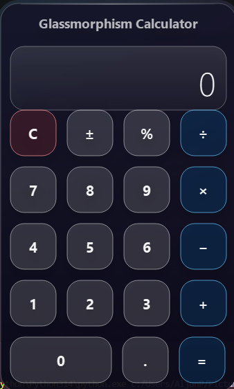

# Glassmorphism Calculator

A sleek, minimalist calculator built with **PyQt6** featuring a modern glassmorphism design, smooth animations, and a fully draggable frameless window.




## ✨ Features

- 🎨 **Glassmorphism UI** — Frosted glass aesthetic with gradient glow effects
- 🖱️ **Draggable Frameless Window** — Clean, borderless design you can move anywhere
- ✨ **Smooth Animations** — Hover opacity, press scale, and elastic release effects
- 🧮 **Full Calculator Logic** — Standard operations with expression history display
- 🎯 **Custom Glass Buttons** — Three visual variants: default, accent (operators), and danger (clear)

## 🚀 Quick Start

### Prerequisites
- Python 3.9 or higher
- pip

### Installation

```bash
# Clone the repository
git clone https://github.com/yourusername/glassmorphism-calculator.git
cd glassmorphism-calculator

# Install dependencies
pip install -r requirements.txt

# Run the calculator
python -m src.calculator
```

## 🖼️ Preview

| Feature | Description |
|---------|-------------|
| **Glass Display** | Shows current expression and result with subtle gradient background |
| **Animated Buttons** | Hover glow, press shrink, elastic release |
| **Window Shadow** | Multi-layer drop shadow for depth |
| **Top Highlight** | Subtle light reflection line for realism |

## 🛠️ Tech Stack

- **PyQt6** — Cross-platform GUI framework
- **QPainter** — Custom widget rendering
- **QPropertyAnimation** — Smooth UI transitions
- **QGraphicsDropShadowEffect** — Depth and shadow effects

## 📁 Project Structure

```
glassmorphism-calculator/
├── src/
│   └── calculator.py      # Main application
├── tests/
│   └── test_calculator.py # Unit tests
├── assets/
│   └── screenshot.png     # UI preview
├── requirements.txt
├── pyproject.toml
└── README.md
```

## 🤝 Contributing

Contributions are welcome! Please read [CONTRIBUTING.md](docs/CONTRIBUTING.md) for guidelines.

## 📄 License

This project is licensed under the MIT License — see the [LICENSE](LICENSE) file for details.

---

Built with 💙 by Aljun Pagasi-an
